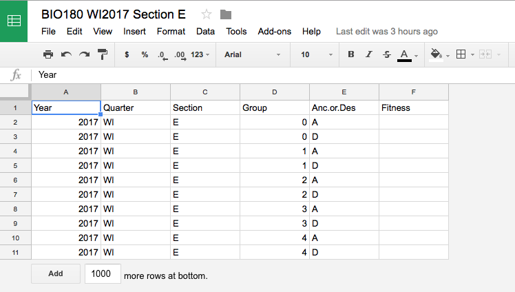

```{r setup,include=FALSE}
library(introbiocure)
#gs_auth()
```


Class data are stored as Google Sheets.
The `introbiocure` package contains several tools for creating, exporting, and analyzing these data.
Each course section has its own spreadsheet.
This document shows how these spreadsheets are created and prepared.


## First Steps

Before we can begin, open RStudio and load the `introbiocure` package.
We'll also run the `gs_auth` command to log into your Google account.
This will open up a login page in your web browser.

```{r Loading introbiocure,eval=FALSE}
library(introbiocure)

gs_auth()
```


## Creating a Section Spreadsheet

First, we'll create a spreadsheet for a section using the `create_section_spreadsheet180` or `create_section_spreadsheet200` function, depending on the course.
For example, let's create a spreadsheet for a section of BIO 180 (and save some information in a variable called `section_E`:

```{r Creating a BIO 180 Section,eval=FALSE}
section_E <- create_section_spreadsheet_180(year = 2017, quarter = "WI", section = "E", num_groups = 4)
```

If you're managing multiple sections, you'll want to repeat this process for each section, changing the `section` argument each time.
Like most commands provided by `introbiocure`, you can learn more by visiting that function's help page by running `?<command>` (e.g., `?create_section_spreadsheet_180`).


## Viewing a Section Spreadsheet

Now let's open our new spreadsheet (named *BIO180 WI2017 Section E*) in Google Sheets.

```{r Viewing a Section Spreadsheet,eval=FALSE}
view_section_spreadsheet(course = 180, year = 2017, quarter = "WI", section = "E")
```

Alternately, we can use the `gs_browse` function from the [googlesheets](https://github.com/jennybc/googlesheets) package.

```{r Viewing a Section Spreadsheet with gs_browse,eval=FALSE}
googlesheets::gs_browse(section_E)
```


You should see something like this:




## Editing a Section Spreadsheet

- TODO: lock cells
- TODO: freeze row 1
- TODO: input validation


## Sharing a Section Spreadsheet

TODO


## Listing Existing Spreadsheets

You can also list the existing course spreadsheets in your account using the `list_course_spreadsheets` function:

```{r Listing Existing Spreadsheets,eval=FALSE}
list_course_spreadsheets()
```

If you'd like to focus on a particular year or course, those can be specified by arguments.
For example:

```{r Listing Existing Spreadsheets 180,eval=FALSE}
list_course_spreadsheets(course = 180, year = 2017)
```


## Retrieving and Saving Section Data

`get_section_data` allows you to import a section's data into R.
For example, to retrieve data for the section we created and store it as a data frame named `df`:

```{r Get Section Data,eval=FALSE}
df <- get_section_data(course = 180, year = 2017, quarter = "WI", section = "E")
```

Or, use `save_section_data` to get a section's data and save it to a .csv file:

```{r Save Data as CSV,eval=FALSE}
save_section_data(path = 'BIO_180-section_E.csv', course = 180, year = 2017, quarter = "WI", section = "E")
```


## Deleting a Spreadsheet

If, for some reason, you need to delete a spreadsheet, use `delete_section_spreadsheet`.
