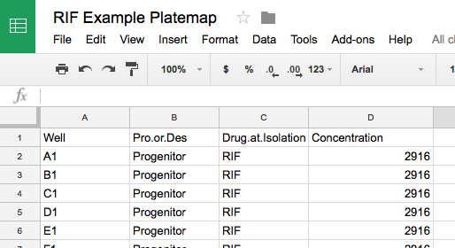
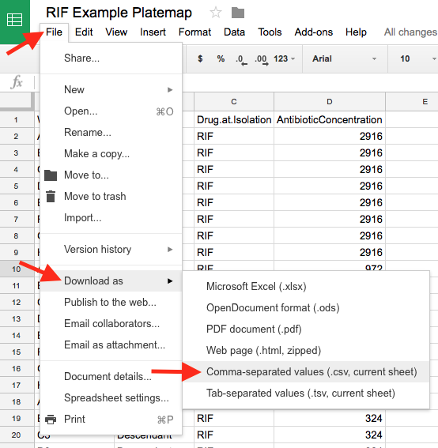

```{r setup, include=FALSE}
knitr::opts_chunk$set(echo = TRUE)
```

This document describes how data from the MIC lab is retrieved from the spectrophotometer, annotated, analyzed, and plotted.

1. Load SoftMax Pro
1. Create a new Experiment file and save it as something good.
1. Set wavelength, etc.
1. for each section, group, plate
    - create a new plate named Sxx-G-xx-xxx
    - Read the plate
1. save the session
1. export xml


## Reading Absorbance Data on the Spec

TODO

Plate name format:  "S([A-Za-z]{1,2})G([0-9]{1,2})-([A-Za-z]{3})" (Plate, Section, Group, Drug)

## Exporting Absorbance Data

TODO - xml

## Annotating MIC Data with Plate Maps

Data from the spec only contains information about how cloudy each well in the microtiter plates are.
In order to analyze the data, we're going to have to add additional information about our other experimental variables like which strain is in each well and what the antibiotic concentrations are.
To do this, we're going to create a *plate map*, which maps this information onto the plates.
Since all microtiter plates will most likely be organized using the same pattern, these plate maps only need to be created once for each different layout.
If you already have a plate map for the plates that you'll be reading, you can skip the rest of this section.

### Plate Map Format

A plate map is basically a spreadsheet with a column containing each **Well** in a microtiter plate and additional columns for each experimental variable.
For our MIC data, we will need three additional columns: **Pro.or.Des**, **Drug.at.Isolation**, and **Concentration** (these exact names are *very* important!).
For example:



**Note:** If a well is not being used, it does not need to be included as a row in the plate map.

Values for columns **Pro.or.Des** and **Drug.at.Isolation** should match those in the section spreadsheets:

- **Pro.or.Des**: Values *Progenitor* or *Descendant*
- **Drug.at.Isolation**: Values *None*, *RIF*, and *STR*

For control wells, where no bacteria are added, leave cells in these columns empty (or `NA`).

Plate maps can be created using programs like [Google Sheets](https://sheets.google.com) (template [here](https://docs.google.com/spreadsheets/d/1Lv3eiZfFOevG_9ajO-S8ixWpkS2lTXq1Uvru9aGKAd0/edit?usp=sharing)), Excel, or Apple Numbers.
Importantly, the plate map must be exported to a CSV file.
For Google Sheets, choose **File**, **Download as**, and **Comma-separated values (.csv, current sheet)**.
For Excel, choose .csv as **Format** under **File**, **Save As...**.
For Numbers, choose **File**, **Export To**, **CSV...**.



Plate maps should be created for each antibiotic used.
A good file name would include information about the antibiotic and when it is being used (e.g., "RIF-PlateMap-SP2018.csv").


### Creating an Annotated Data Set

Now we'll pull the data from the file exported by the spec, read the plate map, and combine the two into our annotated data set.
We'll also extract section, group, and antibiotic information from the plate names.

```{r Read Spec XML File, eval=FALSE}
library(introbiocure)

dSpec <- read_spec_data(file = "my_xml_file.xml")
```


### TODO: RIF control plate, platemap, data

## Creating MIC Plate Diagrams

Now that we've loaded our data and our platemap(s), it's time to create the plate diagrams.

First, we want to make sure that we're using a consistent grey scale to indicate the cloudiness of each well.
To do this, we'll find the maximum value seen among all plates:

```{r Find max absorbance, eval=FALSE}
max_absorbance_seen <- max(controls_annotated$Absorbance, group_annotated$Absorbance, group_annotated$Absorbance.Adj, na.rm = TRUE)
```

Now when we have R plot all of our plate diagrams, we can tell it that `max_absorbance_seen` is the highest value to expect.
These values will get the darkest shade of grey.

Let's make the plate diagrams for the control plate(s):

```{r Plotting Control Plate Diagrams, eval=FALSE}
make_MIC_control_plots(controls_annotated, path = "~/Desktop/MIC_Diagrams", absorbance_max = max_absorbance_seen)
```

This will store the figures in the `MIC_Diagrams` folder on your desktop.
To change this, give `path` a different location.

Similarly, we can make the plates for all of the groups:

```{r Plotting Group Plate Diagrams, eval=FALSE}
make_MIC_section_plots(group_annotated, path = "~/Desktop/MIC_Diagrams", absorbance_max = max_absorbance_seen)
```

This will place the figures in the same folder.
By default, it will also create a new sub-folder for each group.


### Putting it All Together

Here's a sample script that handles the entire process of importing the data, annotating it, and producing the plate diagrams.

```{r Making MIC Plate Diagrams - All, eval=FALSE}
library(introbiocure)
library(dplyr)

# Read the XML file that we exported from the spec
# - Change the file name argument to match the file that you created
plate_data <- read_spec_data(file = "BIO180-MIC-AU2018.xml")

# Read our plate map CSV file(s), one per Drug
plate_maps <- load_platemaps(
    RIF = "platemap-RIF.csv",
    STR = "platemap-STR.csv"
)

# Now let's "annotate" our control plate data by combining it with the plate map(s)
controls_annotated <- plate_data$Controls %>%
    inner_join(plate_maps, by = c("Drug", "Well")) %>%
    mutate(
        Drug = as.factor(Drug),
        Well = as.factor(Well),
        Pro.or.Des = NA,
        Drug.at.Isolation = NA
    )

# Let's do the same for the data we read for each group
group_annotated <- plate_data$Groups %>%
    inner_join(platemaps, by = c("Drug", "Well"))

# Find the maximum absorbance
max_absorbance_seen <- max(
    controls_annotated$Absorbance,
    group_annotated$Absorbance,
    group_annotated$Absorbance.Adj,
    na.rm = TRUE
)

# Plot the control plate(s)
make_MIC_control_plots(
    controls_annotated,
    path = "~/Desktop/MIC_Diagrams",
    absorbance_max = max_absorbance_seen
)

# Plot the group plates
make_MIC_section_plots(
    group_annotated,
    path = "~/Desktop/MIC_Diagrams",
    absorbance_max = max_absorbance_seen
)
```
