```{r setup, include=FALSE}
knitr::opts_chunk$set(echo = TRUE)
```

This document describes how data from the MIC lab is retrieved from the spectrophotometer, annotated, analyzed, and plotted.


## Reading Absorbance Data on the Spec

First, load SoftMax Pro on the laptop attached to the spec.
If an empty project does not appear, click on the main menu (the microtiter plate in the upper left), and select **New**.

### Read Settings

Now we're going to configure how SoftMax Pro reads the plates.
Click on the **Settings** button in the top area.

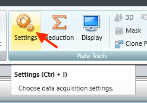
At the top of the Settings screen, make sure that **ABS** (absorbance) is selected under *Read Modes* and that **Endpoint** is selected under *Read Type*.

Next we'll look at some of the settings in the different **Category** menus to the left.
First, select **Wavelengths** and set the machine to read at **595 nm**.

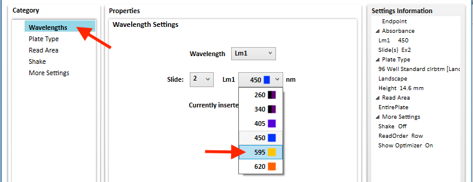

Under **Plate Type**, make sure to check **Is Lidded** and **96 Well Standard clrbtm [Landscape]** is selected.

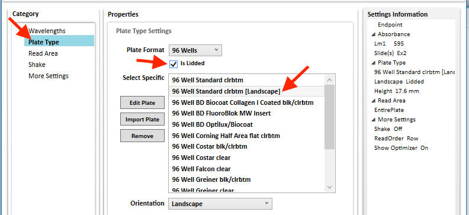

Under **Read Area**, make sure the whole plate is selected.

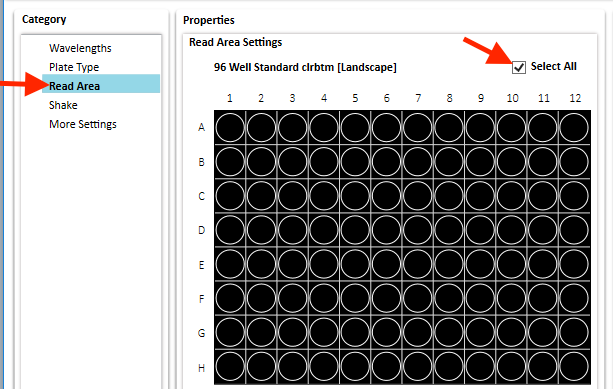

We now have all the important settings made, so hit the **OK** button.


### Creating Plates

Now we're going to create a Plate object for each of the microtiter plates that we'll be reading.
We'll need one for each group and for each antibiotic control plate.
You can view the existing plates on the left side of the screen.

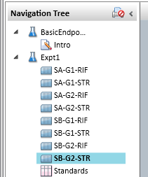

By default, there will already be a plate called *Plate1*.
You can either delete it (right click and select **Delete**) or rename it (right click and select **Rename**).

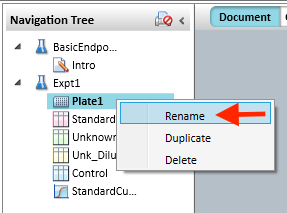

**Naming Plates Correctly is EXTREMELY Important**

Control plates should be named *Control-(Drug)*, where *(Drug)* is replaced with the three-letter drug abbreviation (e.g., *Control-RIF* or *Control-STR*).

Group plates should be named *S(Section)-G(Group)-(Drug)* where *(Section)* is replaced by the section, *(Group)* is replaced by the group number, and *(Drug)* is replaced by the drug abbreviation.
For example, use *SA-G1-RIF* for Section A, Group 1, Rifampicin.

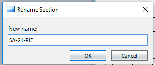

You can add plates by clicking on **New Plate** in the top area.

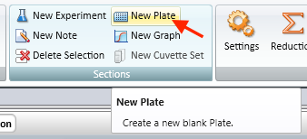

Once you're done creating all of the plates, save your file.


### Reading the Plates

When you're ready to read the plates, select the Plate object on the left hand side that corresponds with the Section/Group/Drug of the microtiter plate that you're ready to read.
Put the plate in the machine and read it by hitting the **Read** button in the top area.

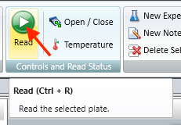

Repeat this process for each microtiter plate, making sure to have the correct Plate object selected.
The process doesn't happen to happen all at once.
You can just read a batch, save the file, and do more reads.

Once you've finished reading all of the plates, be sure to save your file once again to be safe.


## Exporting Absorbance Data

In order to read the data into R for analysis, it's important to export the data as an XML file.
To do this, click on the main menu (the microtiter plate icon in the upper left) and choose **Export**.

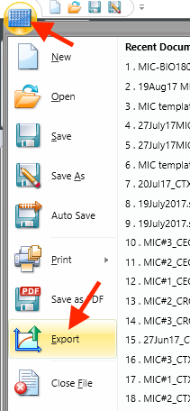

On the next screen, we'll select which plates to export data for.
If you notice plates that cannot be selected, this means that that do not have data.
Make sure you've read those plates.
Checking **All Plates** will select all plates that have data.

Under *Output Format*, be sure to select **XML**.
Once that's done, click the **OK** button.

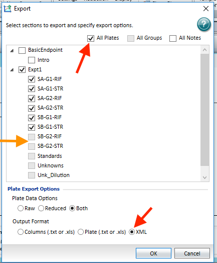

In the next screen, choose where to save the data (This PC > Documents > BIO 180 is a good place) and give it a good file name.
If you'll be doing the analysis on another computer, keep the file in the BIO 180 folder, and create a second copy for yourself.
You can transfer it using a thumb drive.


## Annotating MIC Data with Plate Maps

Data from the spec only contains information about how cloudy each well in the microtiter plates are.
In order to analyze the data, we're going to have to add additional information about our other experimental variables like which strain is in each well and what the antibiotic concentrations are.
To do this, we're going to create a *plate map*, which maps this information onto the plates.
Since all microtiter plates will most likely be organized using the same pattern, these plate maps only need to be created once for each different layout.
If you already have a plate map for the plates that you'll be reading, you can skip the rest of this section.

### Plate Map Format

A plate map is basically a spreadsheet with a column containing each **Well** in a microtiter plate and additional columns for each experimental variable.
For our MIC data, we will need three additional columns: **Pro.or.Des**, **Drug.at.Isolation**, and **Concentration** (these exact names are *very* important!).
For example:


**Note:** If a well is not being used, it does not need to be included as a row in the plate map.

Values for columns **Pro.or.Des** and **Drug.at.Isolation** should match those in the section spreadsheets:

- **Pro.or.Des**: Values *Progenitor* or *Descendant*
- **Drug.at.Isolation**: Values *None*, *RIF*, and *STR*

For control wells, where no bacteria are added, leave cells in these columns empty (or `NA`).

Plate maps can be created using programs like [Google Sheets](https://sheets.google.com) (template [here](https://docs.google.com/spreadsheets/d/1Lv3eiZfFOevG_9ajO-S8ixWpkS2lTXq1Uvru9aGKAd0/edit?usp=sharing)), Excel, or Apple Numbers.
Importantly, the plate map must be exported to a CSV file.
For Google Sheets, choose **File**, **Download as**, and **Comma-separated values (.csv, current sheet)**.
For Excel, choose .csv as **Format** under **File**, **Save As...**.
For Numbers, choose **File**, **Export To**, **CSV...**.


Plate maps should be created for each antibiotic used.
A good file name would include information about the antibiotic and when it is being used (e.g., "RIF-PlateMap-SP2018.csv").


### Creating an Annotated Data Set

Now we'll pull the data from the file exported by the spec, read the plate map, and combine the two into our annotated data set.
This process will also extract section, group, and antibiotic information from the plate names.

First, start RStudio and load the `introbiocure` and `dplyr` packages.
`dplyr` should have been automatically installed, but if it wasn't, run `install.packages("dplyr")`.

```{r Script Start, eval=FALSE}
library(introbiocure)
library(dplyr)
```

Now, let's load the non-annotated data from the XML file that we exported from the spec.
You'll either need to set your working directory to the folder that contains the XML file, or supply the complete path in the file argument.
Assuming that the XML file (called `BIO180-MIC-AU2018.xml`) is in our working directory:

```{r Reading the XML file, eval=FALSE}
plate_data <- read_spec_data(file = "BIO180-MIC-AU2018.xml")
```

`plate_data` now contains the absorbance values for all wells in all plates, including control plates.
But it does not contain any information about which strains, which drugs, or which concentrations are in each well.
To add this information, we'll combine `plate_data` with our plate map.

First, load the plate map using `load_platemaps`, giving it the name of the file(s) that contains your plate map(s).
This function can load one or more plate maps.
Usually, you will need one plate map for each drug used in your MIC assays.

For this example, we only tested against rifampicin (RIF):

```{r Loading plate maps A, eval=FALSE}
plate_maps <- load_platemaps(RIF = "platemap-RIF.csv")
```

If we'd used both RIF and streptomycin (STR), we could do this:

```{r Loading plate maps B, eval=FALSE}
plate_maps <- load_platemaps(
    RIF = "platemap-RIF.csv",
    STR = "platemap-STR.csv"
)
```

Notice how we put the corresponding 3-letter drug abbreviation on the left side of the `=` sign.

Now that we have both the non-annotated data and plate map, we can combine the two, well by well.

```{r Combining data and plate map, eval=FALSE}
group_annotated <- annotate_data(d = plate_data$Groups, platemap = plate_maps)
```

We can do the same for our control data.
For this, we'll also remove the strain (`Pro.or.Des` and `Drug.at.Isolation`) values from the resulting data, since control plates don't contain bacteria.

```{r Combining data and plate map - control, eval=FALSE}
controls_annotated <- annotate_data(d = plate_data$Controls, platemap = plate_maps) %>%
    mutate(
        Pro.or.Des = NA,
        Drug.at.Isolation = NA
    )
```

Now, both `group_annotated` and `controls_annotated` contain information about the cloudiness of each well in all of the plates and the strains, drug(s), and concentrations.


## Creating MIC Plate Diagrams

Now that we've loaded our data and our platemap(s), it's time to create the plate diagrams.

First, we want to make sure that we're using a consistent grey scale to indicate the cloudiness of each well.
To do this, we'll find the maximum value seen among all plates:

```{r Find max absorbance, eval=FALSE}
max_absorbance_seen <- max(
    controls_annotated$Absorbance,
    group_annotated$Absorbance,
    group_annotated$Absorbance.Adj,
    na.rm = TRUE
)
```

Now when we have R plot all of our plate diagrams, we can tell it that `max_absorbance_seen` is the highest value to expect.
These values will get the darkest shade of grey.

Let's make the plate diagrams for the control plate(s):

```{r Plotting Control Plate Diagrams, eval=FALSE}
make_MIC_control_plots(
    controls_annotated,
    path = "~/Desktop/MIC_Diagrams",
    absorbance_max = max_absorbance_seen
)
```

This will store the figures in the `MIC_Diagrams` folder on your desktop.
To change this, give `path` a different location.

Similarly, we can make the plates for all of the groups:

```{r Plotting Group Plate Diagrams, eval=FALSE}
make_MIC_section_plots(
    group_annotated,
    path = "~/Desktop/MIC_Diagrams",
    absorbance_max = max_absorbance_seen
)
```

This will place the figures in the same folder.
By default, it will also create a new sub-folder for each section

Here's an example plate diagram:

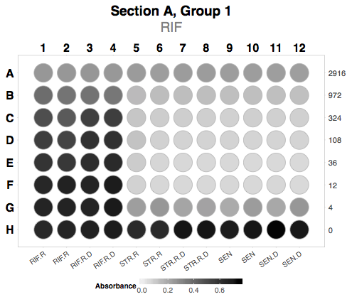

### Putting it All Together

Here's a sample script that handles the entire process of importing the data, annotating it, and producing the plate diagrams.

```{r Making MIC Plate Diagrams - All, eval=FALSE}
library(introbiocure)
library(dplyr)

# Read the XML file that we exported from the spec
# - Change the file name argument to match the file that you created
plate_data <- read_spec_data(file = "BIO180-MIC-AU2018.xml")

# Read our plate map CSV file(s), one per Drug
plate_maps <- load_platemaps(
    RIF = "platemap-RIF.csv",
    STR = "platemap-STR.csv"  # Remove this line and the comma at the
                              # end of the last one if STR wasn't used
)

# Let's do the same for the data we read for each group
group_annotated <- annotate_data(d = plate_data$Groups, platemap = plate_maps)

# Now let's "annotate" our control plate data by combining it with the plate map(s)
# We'll also remove the strain information from the plate map, since control
# plates don't include strains
controls_annotated <- annotate_data(d = plate_data$Controls, platemap = plate_maps) %>%
    mutate(
        Pro.or.Des = NA,
        Drug.at.Isolation = NA
    )

# Find the maximum absorbance
max_absorbance_seen <- max(
    controls_annotated$Absorbance,
    group_annotated$Absorbance,
    group_annotated$Absorbance.Adj,
    na.rm = TRUE
)

# Plot the control plate(s)
make_MIC_control_plots(
    controls_annotated,
    path = "~/Desktop/MIC_Diagrams",
    absorbance_max = max_absorbance_seen
)

# Plot the group plates
make_MIC_section_plots(
    group_annotated,
    path = "~/Desktop/MIC_Diagrams",
    absorbance_max = max_absorbance_seen
)

```
