```{r setup, include=FALSE}
knitr::opts_chunk$set(echo = TRUE)
```

`introbiocure` is a R package containing a set of tools that allow you to create, update, combine, and manipulate data from BIO 180 and BIO 200.
All data are stored as Google spreadsheets.
Each section in BIO 180 and 200 has its own spreadsheet, which students add data to during the quarter.
At the end of each quarter, these data are added to the *Master Spreadsheet*, which contains information about all strains used in these courses.


## Installation

To use `introbiocure`, you'll first need to install a recent version of [RStudio](https://rstudio.com).
After that, you can install `introbiocure` by executing this code in the *Console* window of RStudio:

```{r Install introbiocure, eval=FALSE}
install.packages("devtools")
devtools::install_github("kerrlab/introbiocure", build_vignettes = TRUE)
```

This will also install some additional packages that `introbiocure` requires.


## Logging Into Your Google Account

When you use `introbiocure` for the first time, you will automatically asked to log in to your Google account.
If you'd like to get this out of the way right now, you can run:

```{r Authenticate with Google, eval=FALSE}
googlesheets::gs_auth()
```


## Creating the Master Spreadsheet

Before we can create spreadsheets for either course, we'll need to create the Master Spreadsheet.
The Master Spreadsheet contains information about all of the strains studied in BIO 180 (fitness, MIC) and BIO 200 (mutations).

```{r Creating Master Sheet, eval=FALSE}
master_sheet <- create_master_spreadsheet(title = "Intro Bio Master Spreadsheet")
```

Here, the `create_master_spreadsheet` command (known as a *function*) creates a new Master Spreadsheet named *Intro Bio Master Spreadsheet*.

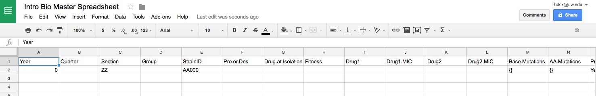

**Note that all functions in `introbiocure` have help pages**, which you can view by typing `?` followed by the function name in the Console.
For example, to get help about `create_master_spreadsheet`, run:

```{r Getting Help, eval=FALSE}
?create_master_spreadsheet
```

For technical reasons, this master spreadsheet will contain one "dummy row" containing invalid data.
This must be left in place until some valid data have been added later, such as at the end of the first quarter.
It can then be removed manually.

### Protecting and Validating Cells in the Master Spreadsheet

As described in the next section, you should now protect the first row of data (the column names) and add data validation to the columns.
This will help prevent errors from going undetected.

Add the following data validation rules to these columns.
- **Year**: Number, greater than or equal to 2017.
- **Quarter**: List of items, "AU,WI,SP,SU UZZ"
- **Section**: Text
- **Group**: Number, greater than or equal to 0.
- **StrainID**: Text
- **Pro.or.Des**: List of items, "Progenitor,Descendent"
- **Drug.at.Isolation**: List of items, "None,RIF,STR"
- **Fitness**: Number, greater than or equal to 0.
- **Drug1** and **Drug2**: List of items, "RIF,STR"
- **Drug1.MIC** and **Drug2.MIC**: Number, greater than or equal to 0.
- **Base.Mutations** and **AA.Mutations**: Text
- **ProblemIdentified** and **SequenceProblemIdentified**: List of items, "Yes,No"

## Creating Section Spreadsheets for BIO 180

At the beginning of each quarter, the course coordinator creates a collection of Google spreadsheets, one for each section.
This can be done using the `create_spreadsheets_180` function.
This function requires some information about the class, such as the quarter and the number of sections.
This information is provided as *arguments* to `create_spreadsheets_180`.

For example, let's create spreadsheets for Spring 2018, which has 10 sections, each with 6 groups of students.

```{r Creating 180 Spreadsheets, eval=FALSE}
sheets_180 <- create_spreadsheets_180(
    master = master_sheet_url, # Note: you'll need to provide a valid URL here.
    year = 2018,
    quarter = "SP",
    num_sections = 10,
    num_groups = 6
)
```

Here, `year` must be a 4-digit number, `quarter` must be a capitalized, two-letter string (one of "AU", "WI", "SP", "SU"), and `num_sections` and `num_groups` must be a number greater than 0.

This creates a spreadsheet for each of the sections (named "BIO180 SP2018 Section A", for example).
The result, called `sheets_180` is a list of objects for each section spreadsheet.
You can either ignore these values or use the [googlesheets](https://github.com/jennybc/googlesheets) package to do different things with them.
For example, to open up the first spreadsheet:

```{r Opening a Sheet, eval=FALSE}
library(googlesheets)

gs_browse(sheets_180[[1]])
```

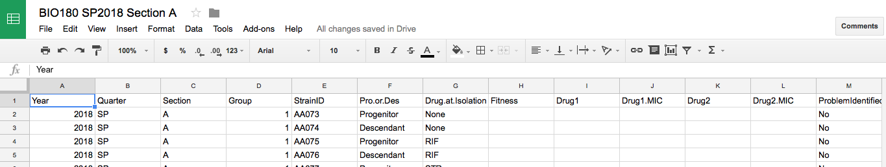

You can also use the `list_course_spreadsheets()` function to view all of your spreadsheets.


### Making Spreadsheets Public

At first, each of the spreadsheets will be Private, so they can only be accessed by the course coordinator.
Each sheet should now be made public (to those who have the URL).
The spreadsheet URLs can be quickly viewed by running the following code, which shows the URL for each section:

```{r Getting Spreadsheet URLs, eval=FALSE}
vapply(sheets_180, function(x) x$browser_url, FUN.VALUE = character(1))
```


To share a spreadsheet, first view it in your web browser.
Click on the **Share** button in the upper right corner, and then click on **Advanced** in the dialog window that appears.

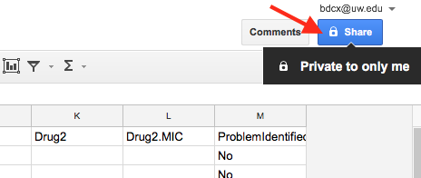

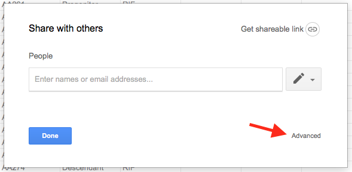

Now in the next dialog window that appears, click on **Change...** under *Who has access*.

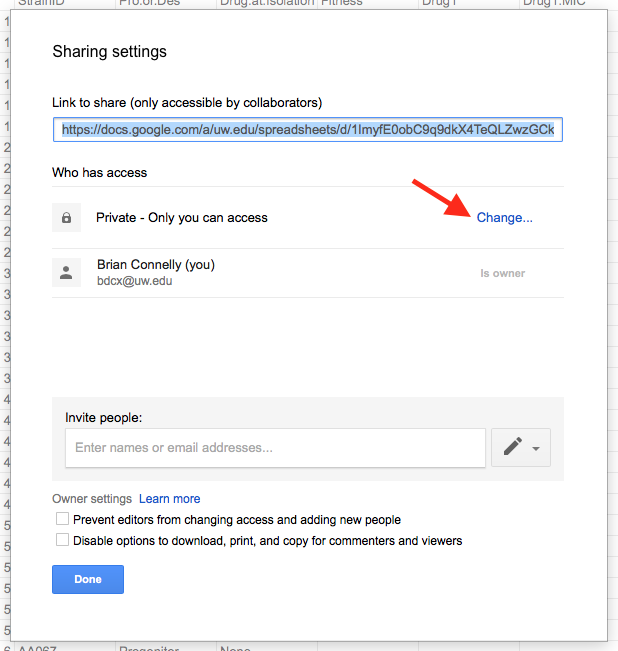
Finally, select **On - Anyone with the link**, and click on the **Save** button.


You can then exit from the main sharing dialog window by clicking on the **Done** button.


### Protecting Columns

To try to keep each spreadsheet error-free, we now want to *Protect* certain columns to prevent students from editing them.
We'll also add some Data Validation to columns to make sure what gets entered is valid.
Unfortunately, this process cannot be automated, so each spreadsheet will need to be manually set up.
Because of this, it may be best that individual TAs do this for their sections before the quarter begins.

To Protect a column, click on that column's header, and then click on the little menu that appears to the right.
Now select **Protect range...**.

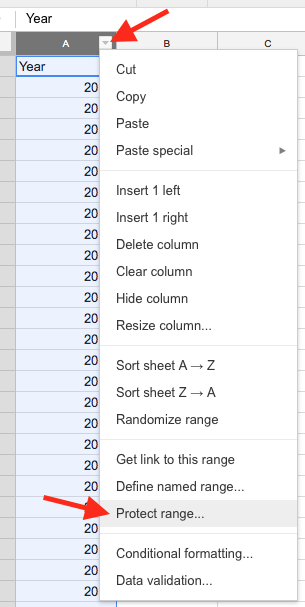

In the box that appears in the upper right, enter a description (e.g., "protected columns"), and select **Set permissions**.

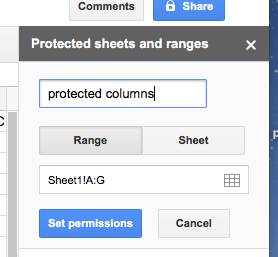

In the next window, select **Restrict who can edit this range**, and choose **Only you**.

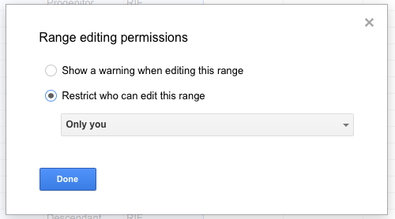


We're going to want to protect the *Year*, *Quarter*, *Section*, *Group*, *StrainID*, *Pro.or.Des*, and *Drug.at.Isolation* columns.
This can be done at once by selecting all of these columns, and choosing to **Protect range...** on that selection.

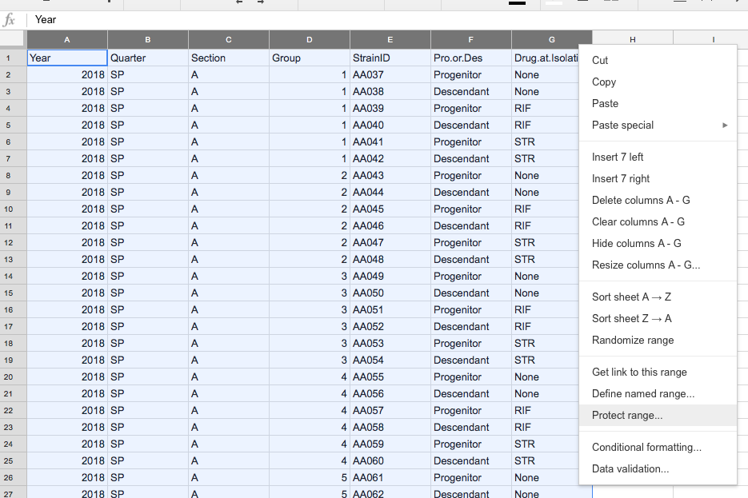

You should also protect the first *row* of data, so that the column names remain consistent.
To do this, select the first row by clicking on the **1** at the far left, right clicking (or two-finger tapping on a Mac) and selecting **Protect range...** from the dropdown menu.
If you're not able to get to the dropdown menu, you can select **Protected sheets and ranges...** from the **Data** menu.
Now name the protected range and set who can edit the cells just as you did before with columns.


### Data Validation

Now, we're going to add some data validation to certain columns to help ensure that students enter appropriate values.
To add validation, select a column, and choose **Data validation...** from the dropdown menu.
Add the following data validation rules to these columns.
For each, choose to **Show warning** for invalid data.

- **Fitness**: Number, greater than or equal to 0.
- **Drug1** and **Drug2**: List of items, "RIF,STR"
- **Drug1.MIC** and **Drug2.MIC**: Number, greater than or equal to 0.
- **ProblemIdentified**: List of items, "Yes,No"

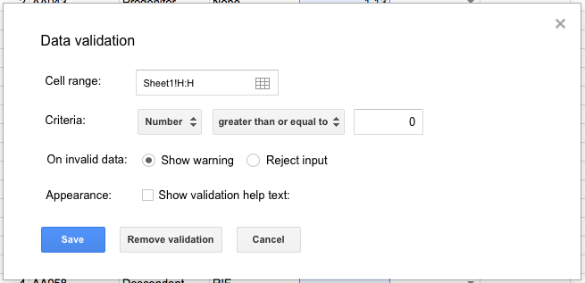

Now, when a cell contains an invalid value, a little red triangle will appear in its corner.

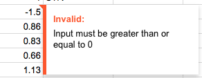

Note that because Google Sheets doesn't differentiate between a header row (the first row) and the rest, some header cells will be marked.


## Adding BIO 180 Data to the Master Spreadsheet

At the end of the quarter, TAs should check over their section data to make sure it's valid.
Once this is done, the data can be added to the master spreadsheet.
This is done by first retrieving the data for the section, and adding it to the master spreadsheet.

First, to get the data, we use `get_section_data_180`, giving it the URL of a section spreadsheet.

```{r Adding 180 Data to Master A, eval=FALSE}
# Note: you'll need to provide a valid URL
section_data <- get_section_data_180(url = my_section_url)
```

A TA with multiple sections can provide multiple section spreadsheet URLS:

```{r Adding 180 Data to Master B, eval=FALSE}
# Note: you'll need to provide valid URLs
section_data <- get_section_data_180(url = c(my_section_1_url, my_section_2_url, my_section_3_url))
```

Now, we can add the section to the master data using `master_add_section_data_180`.
This will catch most basic errors, but please make sure that your section data are valid before running this.

```{r Adding 180 Data to Master C, eval=FALSE}
master_add_section_data_180(master_sheet_url, section_data)
```

Note that if the Master Spreadsheet still has the dummy first row, that can be manually removed once valid data have been added.


## Creating Spreadsheets for BIO 200

The process of creating spreadsheets for BIO 200 is similar to 180.
The course coordinator will give the `create_spreadsheets_200` function the Master Spreadsheet's URL and information about the quarter and the number of sections.
Behind the scenes, this function finds strains from BIO 180 that have not previously been used for BIO 200 and assigns these strains to groups in each section.

For example, here we'll create spreadsheets for a fictional Autumn 2018 quarter where there are 4 groups:

```{r Creating 200 Spreadsheets, eval=FALSE}
sheets_200 <- create_spreadsheets_200(
    master = master_sheet_url,
    year = 2018,
    quarter = "AU",
    num_sections = 4,
    num_groups = 6
)
```

Here, `year` must be a 4-digit number, `quarter` must be a capitalized, two-letter string (one of "AU", "WI", "SP", "SU"), and `num_sections` and `num_groups` must be a number greater than 0.

As with `create_spreadsheets_180`, the result---`sheets_200`---is a list of spreadsheet objects.

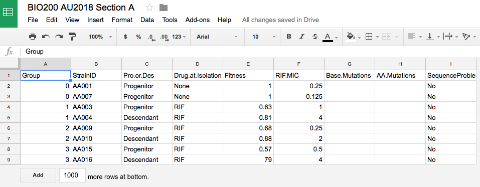

As with BIO 180 Spreadsheets, you'll want to protect some columns and add validation to others.

- Protect columns: **Group**, **StrainID**, **Pro.or.Des**, **Drug.at.Isolation**, **Fitness**, and **RIF.MIC**
- Protect the first row, which contains the column names
- Add validation to **ProblemIdentified**: List of items, "Yes,No"


## Adding BIO 200 Data to the Master Spreadsheet

Just like adding BIO 180 data to the Master Spreadsheet, adding BIO 200 data requires first validating the data, then downloading it, then adding it to the Master Spreadsheet.
Because we're merging the genetic data from BIO 200 with existing data (and a technical issue with Google sheets), this process involves one additional step.

First, we can retrieve the data for one or more BIO 200 sections using `get_section_data_200`:

```{r Adding 200 Data to Master A, eval=FALSE}
# Note: you'll need to provide a valid URL
section_data <- get_section_data_200(url = my_section_url)
```

We can then merge these data with the existing data in the master:

```{r Adding 200 Data to Master B, eval=FALSE}
new_master_data <- master_add_section_data_200(master_sheet_url, section_data)
```


**Importantly, this doesn't update the Master Spreadsheet.**
Instead, the updated master data are stored in a data frame called `new_master_data`.
This is due to some technical limitations with working with spreadsheets programmatically.
Using these data, we now have to create a *new* Master Spreadsheet, which we will use for all future function calls.

We can do this using the `create_master_spreadsheet` again, this time providing initial data:

```{r Adding 200 Data to Master C, eval=FALSE}
new_master_sheet <- create_master_spreadsheet(title = "New Intro Bio Master Spreadsheet", data = new_master_data)
```

Of course, we could give this new spreadsheet the exact same title as before, since the new spreadsheet would have a new unique URL.
This could make it somewhat difficult to remember which is which, though.
A good approach might be to use the same title, but then re-name the old master (e.g., "Intro Bio Master Spreadsheet 2018-09-15" if you replaced it on September 15, 2018).
Because of this complication, it's best to merge *all* of the sections' data at once by providing `get_section_data_200` with the URLs of all section spreadsheets.

```{r Adding 200 Data to Master D, eval=FALSE}
# Note: you'll need to provide valid URLs
section_data <- get_section_data_200(url = c(section_A_url, section_B_url, ..., section_X_url))
```

**You should also protect cells and add data validation to this new Master Spreadsheet.**


## Function Reference

These are the primary functions provided by `introbiocure`.
You can view more information for a given function in its help page (type `?<function name>`).

| Function                          | Description                                                     |
|-----------------------------------|-----------------------------------------------------------------|
| `create_master_spreadsheet`       | Create a new master spreadsheet, either empty or with data      |
| `create_section_spreadsheets_180` | Create spreadsheets for BIO 180 sections                        |
| `create_section_spreadsheets_200` | Create spreadsheets for BIO 200 sections                        |
| `list_course_spreadsheets`        | List your section spreadsheets. Can specify course/quarter/etc. |
| `master_add_section_data_180`     | Add BIO 180 data to the master spreadsheet                      |
| `master_add_section_data_200`     | Merge in BIO 200 data with the master spreadsheet               |
| `get_master_data`                 | Get data from the master spreadsheet as a data frame            |
| `get_section_data_180`            | Get data from one or more BIO 180 sections as a data frame      |
| `get_section_data_200`            | Get data from one or more BIO 200 sections as a data frame      |
| `save_master_data`                | Save data from the master spreadsheet to a CSV file             |
| `save_section_data_180`           | Save data from one or more BIO 180 sections as a CSV file       |
| `save_section_data_200`           | Save data from one or more BIO 200 sections as a CSV file       |

